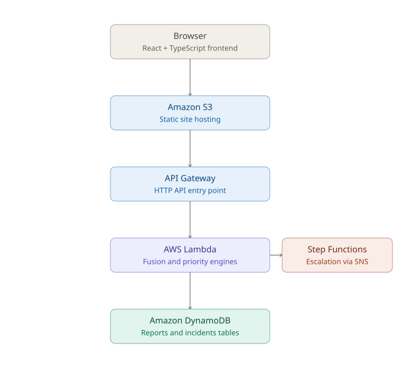

# CIRA 🛡️

### **Cognitive Incident Response & Analytics**
A serverless campus safety engine that turns a flood of independent, differently-worded incident reports into a single, prioritized, actionable incident — live on AWS. Students report what they see in plain language; **CIRA** matches related reports to the same real-world event, assigns a deterministic priority, and orchestrates escalation when a critical incident goes unacknowledged.

---

## 🚀 Key Features

* **Incident Fusion Engine:** Scores every new report against active incidents using four weighted signals — text similarity (a from-scratch TF-IDF + cosine similarity implementation, with a synonym table so "collapsed" and "unconscious" are recognized as related), location similarity, time proximity, and category match. Reports scoring above threshold are merged into the same incident instead of creating duplicates.
* **Deterministic Priority Engine:** Priority (`CRITICAL` / `HIGH` / `MEDIUM` / `LOW`) is decided entirely by fixed backend rules — never by an LLM — so triage decisions stay explainable and testable.
* **Automated State-Machine Escalation:** **AWS Step Functions** orchestrates routing, timeline logging, SNS notifications, and acknowledgement checks, automatically escalating unacknowledged critical incidents.
* **Serverless Backend:** Every operation — report ingestion, incident CRUD, routing, notifications — runs as an independent **AWS Lambda** function behind a single **API Gateway HTTP API**.
* **Live Student & Responder Dashboards:** A React frontend for submitting reports and tracking incidents in real time.

---

## 🏗️ Architecture



The browser loads the static frontend from **Amazon S3** and calls the **API Gateway HTTP API** for all report/incident data. API Gateway invokes **AWS Lambda** functions, where the fusion and priority engines live, which read and write **Amazon DynamoDB**. Lambda also triggers **AWS Step Functions**, which coordinates **Amazon SNS** alerts for critical-incident escalation.

---

## 🛠️ Tech Stack

* **Frontend:** React (Vite), TypeScript, TailwindCSS — built as a static site and hosted on Amazon S3
* **Backend:** Python 3.12 on AWS Lambda
* **API:** Amazon API Gateway (HTTP API)
* **Database:** Amazon DynamoDB (on-demand capacity) — separate tables for reports, incidents, and the incident timeline
* **Orchestration & Alerts:** AWS Step Functions, Amazon SNS
* **Infrastructure as Code:** AWS SAM (`infrastructure/template.yaml`)
* **AI extraction (optional, not yet wired to the frontend):** AWS Bedrock (Claude 3 Haiku) — code exists in `backend/lambda/ai_extraction/` and `backend/services/bedrock_service.py`, but no current route submits to it end-to-end. See [Roadmap](#-roadmap).

---

## 📁 Repository Structure

```text
Cira/
│
├── frontend/                       # React (Vite + TypeScript) web app
│   ├── src/
│   │   ├── components/             # Student, responder, and command-center UI
│   │   ├── context/                # CampusPulseContext — app state + real API calls
│   │   └── services/
│   │       ├── api.ts              # Typed client for the live backend API
│   │       ├── fusionEngine.ts     # Local demo-mode fusion (mirrors the backend)
│   │       └── priorityEngine.ts   # Local demo-mode priority (mirrors the backend)
│   ├── dist/                       # Production build output (uploaded to S3)
│   └── .env                        # VITE_API_BASE_URL — points at the deployed API
│
├── backend/                        # Python Lambda backend
│   ├── lambda/
│   │   ├── reports/                # POST /reports — ingest, fuse/create, prioritize
│   │   ├── incidents/              # GET/PATCH /incidents
│   │   ├── ai_extraction/          # Bedrock-based extraction (not yet routed to)
│   │   ├── routing/                # Selects a responder route for an incident
│   │   ├── timeline/                # Appends incident timeline entries
│   │   ├── notifications/          # Publishes SNS alerts
│   │   └── acknowledgement/        # Checks whether an incident was acknowledged
│   │
│   ├── services/
│   │   ├── dynamodb_service.py     # All DynamoDB access, env-var configured
│   │   ├── fusion_engine.py        # Text/location/time/category similarity + fusion
│   │   ├── priority_engine.py      # Deterministic priority rules
│   │   ├── routing_engine.py       # Responder routing rules
│   │   ├── bedrock_service.py      # Bedrock provider for AI extraction
│   │   └── extraction_service.py   # Extraction orchestration
│   │
│   ├── models/                     # Report, Incident, and schema definitions
│   ├── tests/                      # Unit tests (fusion, priority, routing)
│   └── requirements.txt
│
├── workflows/escalation/
│   └── state-machine.json          # Step Functions escalation workflow definition
│
├── infrastructure/
│   └── template.yaml               # AWS SAM template — the whole stack
│
├── docs/
│   └── architecture.svg            # Architecture diagram used above
│
├── .gitignore
└── README.md
```

---

## ☁️ Deploying the backend (AWS SAM)

### Prerequisites
* Python 3.12+
* Node.js 18+
* AWS CLI v2, configured (`aws configure`)
* AWS SAM CLI

### Deploy
```bash
cd infrastructure
sam build
sam deploy --guided   # first time; subsequent deploys just need `sam deploy`
```

SAM prints an **`ApiUrl`** output when it finishes — that's the live backend base URL.

### Run backend tests locally
```bash
cd backend
pip install -r requirements.txt
python -m unittest discover -s tests -v
```

---

## 💻 Running the frontend

```bash
cd frontend
npm install
```

Set `VITE_API_BASE_URL` in `frontend/.env` to the `ApiUrl` from your SAM deploy, then:

```bash
npm run dev      # local development
npm run build    # production build, output in dist/ — upload to your S3 bucket
```

> **Note:** if you ever build on a different OS than you last ran `npm install` on, delete `node_modules` and `package-lock.json` and reinstall — native dependencies (e.g. Rollup) are platform-specific.

---

## 🗺️ Roadmap

* Wire `backend/lambda/ai_extraction/` (AWS Bedrock, Claude 3 Haiku) into the report-submission flow, so unstructured report text is parsed into structured facts *before* the deterministic fusion and priority engines run — keeping the actual triage decision explainable while letting Bedrock handle the messy language understanding.
* Replace the frontend's local fusion/priority simulation with the live backend as the sole source of truth, once the richer local data model (timeline, fusion explanations, evidence attachments) is fully supported server-side.

---

## ⚖️ License
This project is open-source software licensed under the MIT License.
